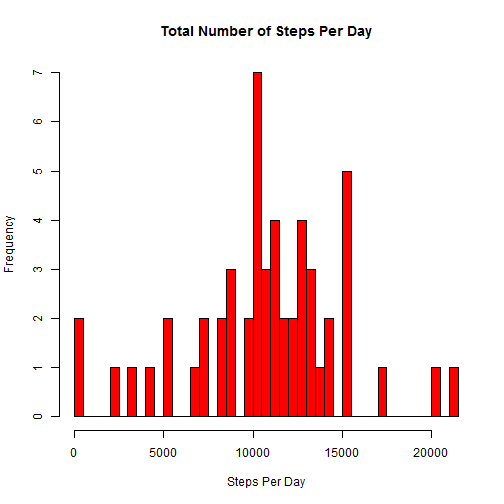
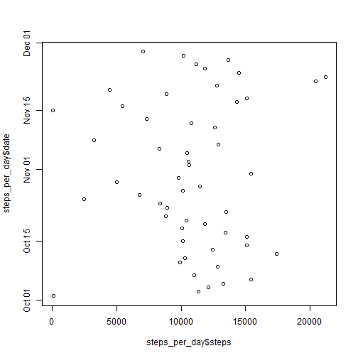
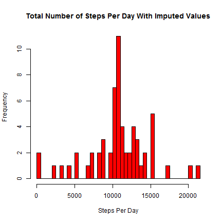
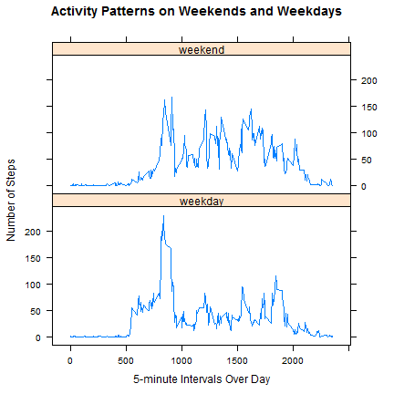

# Reproducible Research: Peer Assessment 1


## Part 1: Loading and preprocessing the data

1. Load the data (i.e. read.csv())
2. Process/transform the data (if necessary) into a format suitable for your analysis

```r
Load_Data <- read.table(unz("activity.zip", "activity.csv"), header = T, quote = "\"", 
    sep = ",")
Rep_Data <- as.data.frame(Load_Data)
# Rep_Data <- Rep_Data[!is.na(Rep_Data$steps),]
Rep_Data$date <- as.Date(Rep_Data$date, "%Y-%m-%d")
```


## Part 2: What is mean total number of steps taken per day?

1. Make a histogram of the total number of steps taken each day

```r
steps_per_day <- aggregate(steps ~ date, data = Rep_Data, FUN = sum)
# 53 entries: date steps

hist(steps_per_day$steps, breaks = nrow(steps_per_day), main = "Total Number of Steps Per Day", 
    xlab = "Steps Per Day", col = "red")
```

 

```r
plot(steps_per_day$steps, steps_per_day$date)
```

 


2. Calculate and report the mean and median total number of steps taken per day

```r
mean_steps_per_day <- mean(steps_per_day$steps)
median_steps_per_day <- median(steps_per_day$steps)
```

The mean total number of steps taken per day is 10766 

The median total number of steps taken per day is 10765


## Part 3: What is the average daily activity pattern?

1. Make a time series plot (i.e. type = "l") of the 5-minute interval (x-axis) and the average number of steps taken, averaged across all days (y-axis)
2. Which 5-minute interval, on average across all the days in the dataset, contains the maximum number of steps?

```r
aver_per_interval <- aggregate(steps ~ interval, data = Rep_Data, FUN = mean)  ## aver #steps/Interval
plot(aver_per_interval, type = "l", main = "Average Daily Activity Pattern", 
    xlab = "5-minute Intervals Over Day", ylab = "Average Steps Taken Over All Days")
```

 

```r
max_interval <- aver_per_interval[which.max(aver_per_interval$steps), "interval"]
```


The 5-minute interval, on average across all days, that contains the maximum number of steps is 
835


## Part 4:  Imputing missing values

1. Calculate and report the total number of missing values in the dataset (i.e. the total number of rows with NAs)

```r
number_missing_values <- sum(is.na(Rep_Data))
number_missing_values  # 2304
```

```
## [1] 2304
```


2. Devise a strategy for filling in all of the missing values in the dataset. The strategy does not need to be sophisticated. For example, you could use the mean/median for that day, or the mean for that 5-minute interval, etc.


```r
imputed_steps <- numeric()
for (i in 1:nrow(Rep_Data)) {
    obs <- Rep_Data[i, ]
    if (is.na(obs$steps)) {
        steps <- subset(aver_per_interval, interval == obs$interval)$steps
    } else {
        steps <- obs$steps
    }
    imputed_steps <- c(imputed_steps, steps)
}
```


3. Create a new dataset that is equal to the original dataset but with the missing data filled in.


```r
imputed_data <- Rep_Data
imputed_data$steps <- imputed_steps
```


4. Make a histogram of the total number of steps taken each day and Calculate and report the mean and median total number of steps taken per day. Do these values differ from the estimates from the first part of the assignment? What is the impact of imputing missing data on the estimates of the total daily number of steps?


```r
# The total number of steps taken each day
imputed_steps_per_day <- aggregate(steps ~ date, data = imputed_data, FUN = sum)

hist(imputed_steps_per_day$steps, breaks = nrow(imputed_steps_per_day), main = "Total Number of Steps Per Day With Imputed Values", 
    xlab = "Steps Per Day", col = "red")
```

 

```r

# The mean and median total number of steps taken per day
imputed_mean_steps_per_day <- mean(imputed_steps_per_day$steps)
imputed_median_steps_per_day <- median(imputed_steps_per_day$steps)
```


The mean total number of steps taken per day is 10766

The median total number of steps taken per day is 10766

Slight increase in the median total number of steps per day. No changes to the mean


## Part 5: Are there differences in activity patterns between weekdays and weekends?


```r
imputed_data$date <- as.Date(imputed_data$date)
weekend_days <- c("Saturday", "Sunday")
imputed_data$daytype <- as.factor(sapply(imputed_data$date, function(x) ifelse(weekdays(x) %in% 
    weekend_days, "weekend", "weekday")))
```


```r
require(plyr)
```

```
## Loading required package: plyr
```

```r
require(lattice)

average_steps <- ddply(imputed_data, .(interval, daytype), summarize, steps = mean(steps))

xyplot(steps ~ interval | daytype, data = average_steps, layout = c(1, 2), type = "l", 
    xlab = "5-minute Intervals Over Day", ylab = "Number of Steps", main = "Activity Patterns on Weekends and Weekdays")
```

 


